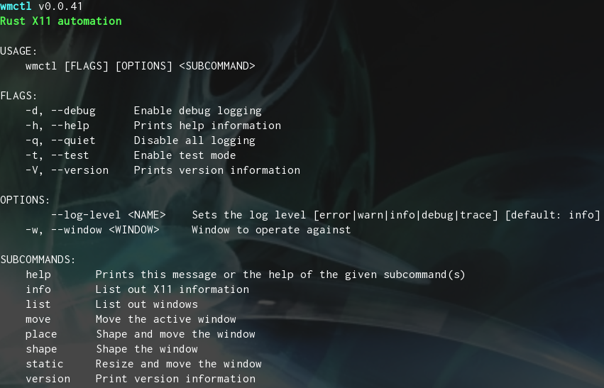

# wmctl
[](https://opensource.org/licenses/MIT)
[](https://crates.io/crates/wmctl)
[](https://github.com/phR0ze/gory#rustc-requirements)

***Rust X11 automation***

`wmctl` implements the [Extended Window Manager Hints (EWMH) specification](https://specifications.freedesktop.org/wm-spec/latest/)
as a way to work along side EWMH compatible window managers as a companion. `wmctl` provides the 
ability to precisely define how windows should be shaped and placed and can fill in gaps for window 
managers lacking some shaping or placement features. Mapping wmctl commands to user defined hot key 
sequences will allow for easy window manipulation beyond what your favorite EWMH window manager 
provides.

### Disclaimer
***wmctl*** comes with absolutely no guarantees or support of any kind. It is to be used at
your own risk. Any damages, issues, losses or problems caused by the use of ***wmctl*** are
strictly the responsiblity of the user and not the developer/creator of ***wmctl***.

### Quick links
* [Usage](#usage)
  * [Shape window](#shape-window)
  * [Move window](#move-window)
  * [Place window](#place-window)
* [Development](#development)
  * [Run Examples](#run-examples)
* [License](#license)
  * [Contribution](#contribution)
* [Backlog](#backlog)
* [Changelog](#changelog)

## Usage
***rustc >= 1.30*** is required due to the 
[tracing\_subscriber](https://docs.rs/tracing-subscriber/0.2.15/tracing_subscriber) requirements

`$ wmctl -h` for cli help


### Shape window
Shape the active window using the pre-defined `small` shape which is a quarter of the screen.
```bash
$ wmctl shape small
```

### Move window
Move the active window to the bottom left corner of the screen.
```bash
$ wmctl move bottom-left
```

### Place window
Combine the shape and move into a single command by placing the window. First the window is shaped 
using the pre-defined `halfw` shape then it is moved to the top left of the screen in a single 
operation.
```bash
$ wmctl place halfw top-left
```

## Development

### Run Examples

## License
This project is licensed under either of:
 * MIT license [LICENSE-MIT](LICENSE-MIT) or http://opensource.org/licenses/MIT
 * Apache License, Version 2.0 [LICENSE-APACHE](LICENSE-APACHE) or http://www.apache.org/licenses/LICENSE-2.0

### Contribution
Pull requests are always welcome. However understand that they will be evaluated purely on whether
or not the change fits with my goals/ideals for the project.

Unless you explicitly state otherwise, any contribution intentionally submitted for inclusion in
this project by you, as defined in the Apache-2.0 license, shall be dual licensed as above, without
any additional terms or conditions.

---

## Backlog

## Changelog
* 5/30/2024
  * Fix for GTK Client-side window decorations are not being calculated correctly
* 12/18/2021
  * Add Arch Linux packaging
  * Added public documentation
  * Fix to precisely place windows with Xfwm4
  * Completed move, shape and place implementation
